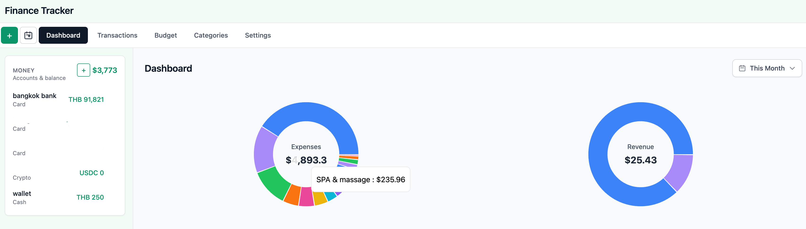
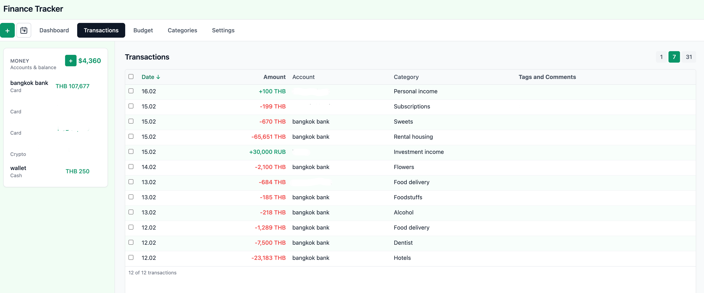

# Finance Tracker

React-based web app for tracking finances: multi-currency accounts, transactions, categories, and monthly budget.

## Screenshots





## License

MIT. See [LICENSE](LICENSE). Use and redistribution are allowed; if you publish or distribute this project (or a derivative), you must keep the license and copyright notice, which includes a link to this repository.

## Tech stack

- **React 18** + **TypeScript** (Vite)
- **React Router** for SPA routing
- **Tailwind CSS** for styling
- Responsive layout (desktop and mobile)

## Project structure

```
src/
  app/           # App root and routing (App.tsx)
  components/    # Reusable UI (e.g. app-layout)
  lib/           # Utilities (clsx, future API client)
  pages/         # Route-level pages (dashboard, transactions, budget, etc.)
  types/         # Shared TypeScript types (Account, Category, Transaction)
  index.css      # Global Tailwind styles
  main.tsx       # Entry point
```

## Commands

- `npm run dev` — start dev server (default http://localhost:5173)
- `npm run server` — start API server (default http://localhost:3001)
- `npm run build` — type-check and production build
- `npm run preview` — serve production build locally
- `npm run lint` — run ESLint

## Docker

Run the app and Postgres with Docker Compose:

```bash
docker compose up -d
```

- **Postgres**: user `tracker`, database `tracker`, data in `./data`
- **App**: http://localhost:3001 (API + built frontend)
- Schema and migrations are applied automatically on first start via the `db-init` service.

### Authentication

The app uses login/password authentication. Set these environment variables (or use `.env`):

- `INITIAL_LOGIN` — initial email/login (e.g. `admin@example.com`)
- `INITIAL_PASSWORD` — initial password
- `SESSION_SECRET` — secret for session cookies (required in production)
- `RESET_CREDENTIALS` — set to `true` to force-reset login and password to initial values on startup (useful for recovery)

On first run, the app creates or migrates the single user with these credentials. You can change login and password later in Settings.

Rebuild the app image after code changes:

```bash
docker compose up -d --build app
```

## Cloudflare Tunnel (optional)

The SMS auto-import webhook (`POST /api/sms-webhook`) requires the server to be reachable from the internet. **Cloudflare Tunnel** provides a free, secure way to expose it without opening firewall ports or configuring a reverse proxy.

### Quick start (temporary URL)

```bash
# Requires cloudflared installed on the host
cloudflared tunnel --url http://localhost:3001
```

This prints a public `https://*.trycloudflare.com` URL you can use immediately. The URL changes every time you restart.

### Persistent setup via Docker Compose

1. Sign in to the [Cloudflare Zero Trust dashboard](https://one.dash.cloudflare.com) and go to **Networks → Tunnels**.
2. Create a new tunnel and copy the tunnel token.
3. Add the token to your `.env` file:

```bash
CLOUDFLARE_TUNNEL_TOKEN=eyJhIjoi...
```

4. Start everything (including the tunnel):

```bash
docker compose --profile tunnel up -d
```

The `cloudflared` service starts alongside the app and automatically reconnects if the container restarts. To stop only the tunnel, run `docker compose --profile tunnel stop cloudflared`.

### Custom domain

In the Cloudflare dashboard, add a **Public Hostname** to your tunnel (e.g. `finance.example.com`) and point it to `http://app:3001`. The tunnel container shares the Docker network with the app, so it can reach it by service name.

## Next steps

- Implement dashboard balance panel, transaction forms, category CRUD, budget plan/fact views
